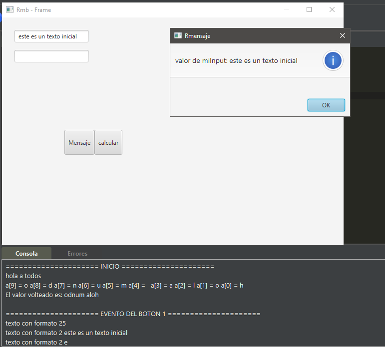
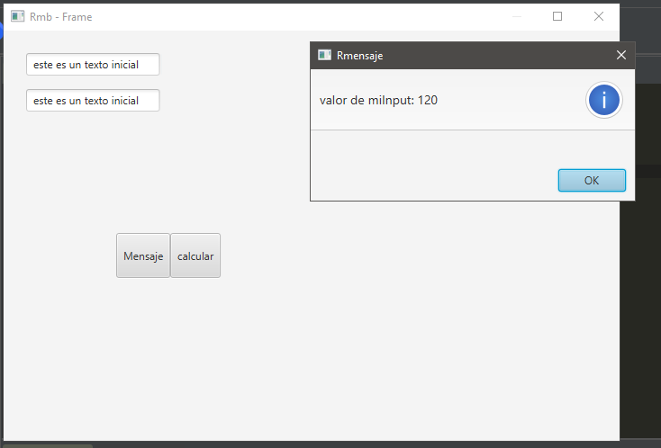

# Prueba con imports

## Mensaje 1

## Mensaje 2

## Salida de consola:

===================== INICIO =====================

hola a todos

a[9] = o a[8] = d a[7] = n a[6] = u a[5] = m a[4] = a[3] = a a[2] = l a[1] = o a[0] = h

El valor volteado es: odnum aloh

===================== EVENTO DEL BOTON 1 =====================

texto con formato 25

texto con formato 2 este es un texto inicial

texto con formato 2 e

===================== EVENTO DEL BOTON 2 =====================

texto con formato 25

===== SALIDA DESPUES DEL FRAME

constante_por_dos = 50

multiplicar(4, 5) = 20
